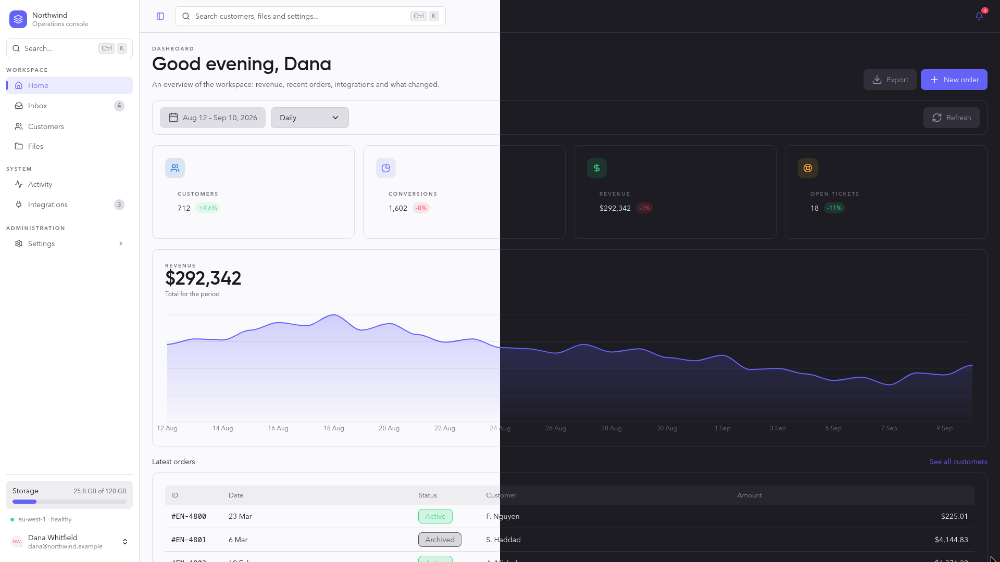
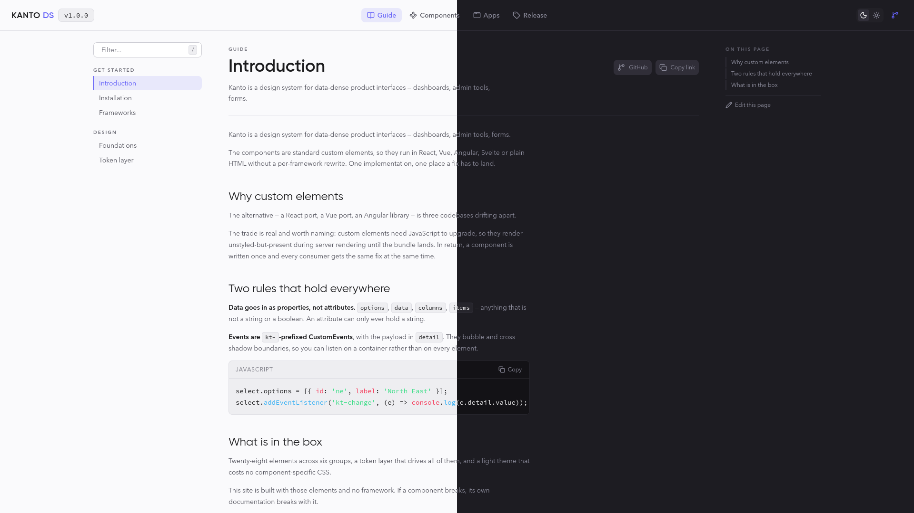
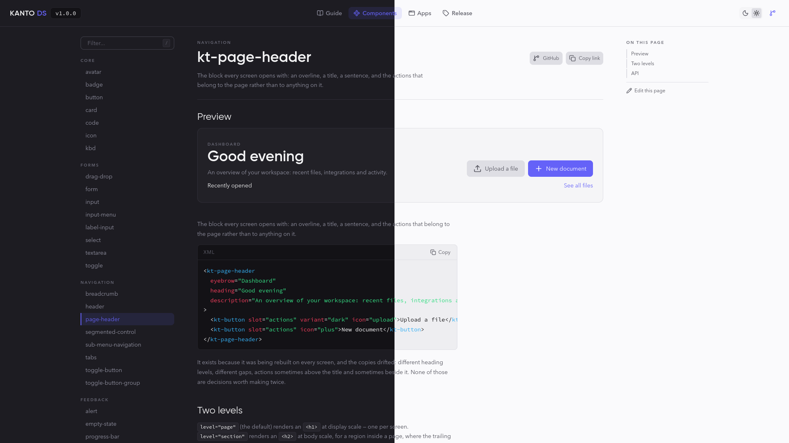

# Kanto

**A design system for data-dense product interfaces** — dashboards, admin
tools, forms.

The components are standard custom elements, so they run in React, Vue,
Angular, Svelte or plain HTML without a per-framework rewrite.

```bash
npm install kanto-ds
```

```js
import 'kanto-ds';
import 'kanto-ds/styles.css';
```

```html
<kt-card>
  <h6 slot="header">Recent transactions</h6>
  <kt-table></kt-table>
  <kt-button slot="footer" variant="text">View full history</kt-button>
</kt-card>
```

---

## Showcase



|  |  |
| ----------------------------------- | ------------------------------------------- |

## Why custom elements

One implementation, every framework. The alternative — a React port, a Vue
port, an Angular library — is three codebases drifting apart.

The trade is real and worth naming: custom elements need JavaScript to upgrade,
so they render unstyled-but-present during SSR until the bundle lands. In
return, a component is written once and a fix reaches every consumer at the same
time.

See **[docs/frameworks.md](docs/frameworks.md)** for the per-framework setup.
Two rules hold everywhere:

- **Data goes in as properties, not attributes.** `options`, `data`, `columns`,
  `items` — anything that is not a string or a boolean. An attribute can only
  hold a string.
- **Events are `kt-`-prefixed CustomEvents**, payload in `detail`. They bubble
  and cross shadow boundaries, so you can listen on a container.

## The system

**Two complete themes.** `:root` carries dark, which is what you get by
default; `data-theme="light"` switches, and `data-theme="auto"` follows the OS.
Both are built from the same token names, so no component has theme-specific
CSS and neither theme is an afterthought.

**Elevation is a lighter surface, not a shadow.** Surfaces are an eleven-step
ramp, `--color-dark-8` through `--color-dark-24`. The only real shadow in the
system is on toasts, which genuinely float.

**Fields take an outline, never a border.** A border would reflow the field on
focus; the outline sits outside the box — grey on hover, primary on focus,
danger on error.

**Motion is fast and utilitarian.** 100–200ms, no bounces, no springs. The one
decorative animation is the striped progress bar, and it earns its place: it is
how an operation says it is still working when the number is not moving.

**Copy is English, and terse.** "Search everything...", "No data to display",
"2 min ago". Sentence case for labels and buttons; uppercase only for overline
section titles. No emoji in product UI — the one exception is the flag in the
phone-input country picker, which is functional.

Every string an element writes itself — empty states, button labels,
validation messages, and the accessible names only a screen reader hears — comes
from one registry. An application in another language replaces them once:

```js
import { setStrings } from 'kanto-ds/strings';

setStrings({
  clear: 'Effacer',
  noData: 'Aucune donnée',
  pageOf: (page, total) => `Page ${page} sur ${total}`,
});
```

Anything left out stays in English, and switching at runtime re-renders every
element. Strings that carry a value are functions, so a translation owns the
word order. Where an element also takes a string as a property (`emptyText`,
`placeholder`, `confirmLabel`…), setting it still wins for that one element.
The full list is `KtStrings` in
[src/internal/strings.ts](src/internal/strings.ts).

Full details in **[src/tokens/README.md](src/tokens/README.md)**.

## Components

Forty-two elements. Each has a page beside its source.

| Group          | Elements                                                                                                                                                                                                                                                                                                                                                                                                                                                                                                                                                                                                                                                       |
| -------------- | -------------------------------------------------------------------------------------------------------------------------------------------------------------------------------------------------------------------------------------------------------------------------------------------------------------------------------------------------------------------------------------------------------------------------------------------------------------------------------------------------------------------------------------------------------------------------------------------------------------------------------------------------------------- |
| **Core**       | [button](src/components/core/kt-button/kt-button.md) · [split-button](src/components/core/kt-split-button/kt-split-button.md) · [card](src/components/core/kt-card/kt-card.md) · [code](src/components/core/kt-code/kt-code.md) · [icon](src/components/core/kt-icon/kt-icon.md) · [avatar](src/components/core/kt-avatar/kt-avatar.md) · [badge](src/components/core/kt-badge/kt-badge.md) · [kbd](src/components/core/kt-kbd/kt-kbd.md)                                                                                                                                                                                                                      |
| **Forms**      | [input](src/components/forms/kt-input/kt-input.md) · [textarea](src/components/forms/kt-textarea/kt-textarea.md) · [label-input](src/components/forms/kt-label-input/kt-label-input.md) · [form](src/components/forms/kt-form/kt-form.md) · [select](src/components/forms/kt-select/kt-select.md) · [input-menu](src/components/forms/kt-input-menu/kt-input-menu.md) · [toggle](src/components/forms/kt-toggle/kt-toggle.md) · [drag-drop](src/components/forms/kt-drag-drop/kt-drag-drop.md)                                                                                                                                                                 |
| **Navigation** | [header](src/components/navigation/kt-header/kt-header.md) · [breadcrumb](src/components/navigation/kt-breadcrumb/kt-breadcrumb.md) · [sub-menu-navigation](src/components/navigation/kt-sub-menu-navigation/kt-sub-menu-navigation.md) · [page-header](src/components/navigation/kt-page-header/kt-page-header.md) · [tabs](src/components/navigation/kt-tabs/kt-tabs.md) · [segmented-control](src/components/navigation/kt-segmented-control/kt-segmented-control.md) · [toggle-button](src/components/navigation/kt-toggle-button/kt-toggle-button.md) · [toggle-button-group](src/components/navigation/kt-toggle-button-group/kt-toggle-button-group.md) |
| **Feedback**   | [progress-bar](src/components/feedback/kt-progress-bar/kt-progress-bar.md) · [skeleton](src/components/feedback/kt-skeleton/kt-skeleton.md) · [tooltip](src/components/feedback/kt-tooltip/kt-tooltip.md) · [toast](src/components/feedback/kt-toast/kt-toast.md) · [toast-container + toaster](src/components/feedback/kt-toast-container/kt-toast-container.md) · [alert](src/components/feedback/kt-alert/kt-alert.md) · [empty-state](src/components/feedback/kt-empty-state/kt-empty-state.md)                                                                                                                                                            |
| **Overlays**   | [dropdown](src/components/overlays/kt-dropdown/kt-dropdown.md) · [side-panel](src/components/overlays/kt-side-panel/kt-side-panel.md) · [confirm-dialog](src/components/overlays/kt-confirm-dialog/kt-confirm-dialog.md) · [modal](src/components/overlays/kt-modal/kt-modal.md) · [collapsible](src/components/overlays/kt-collapsible/kt-collapsible.md)                                                                                                                                                                                                                                                                                                     |
| **Data**       | [table](src/components/data/kt-table/kt-table.md) · [pagination](src/components/data/kt-pagination/kt-pagination.md) · [stat](src/components/data/kt-stat/kt-stat.md) · [chart](src/components/data/kt-chart/kt-chart.md) · [meter](src/components/data/kt-meter/kt-meter.md) · [timeline](src/components/data/kt-timeline/kt-timeline.md)                                                                                                                                                                                                                                                                                                                     |

Import the whole system, or one element:

```js
import 'kanto-ds'; // everything
import 'kanto-ds/components/core/kt-button'; // just this one
```

## Icons

`<kt-icon>` resolves [Lucide](https://lucide.dev) icons by name at render time,
which means the set cannot be tree-shaken. So Kanto ships only the 22 its own
elements draw. Register what your application uses:

```js
import { Rocket, Wallet } from 'lucide';
import { registerIcons } from 'kanto-ds/icons';

registerIcons({ Rocket, Wallet }); // <kt-icon name="rocket">
```

## Forms

Every field is a form-associated custom element. It serialises into `FormData`
under its `name`, resets with the form, and reports validity like a native
input — no hidden mirror inputs, no manual wiring.

```html
<form>
  <kt-label-input label="Email address" required>
    <kt-input name="email" type="email" required></kt-input>
  </kt-label-input>
  <kt-button type="submit">Send</kt-button>
</form>
```

## Editor support

The package ships a [Custom Elements Manifest](https://custom-elements-manifest.open-wc.org/)
— every element's attributes, properties, events, slots and CSS parts — and
editor data generated from it, so plain HTML gets completion and hover docs:

- **WebStorm / JetBrains** read `web-types.json` from the package on their own.
- **VS Code** needs pointing at it once, in `.vscode/settings.json`:

  ```json
  {
    "html.customData": ["./node_modules/kanto-ds/dist/vscode.html-custom-data.json"],
    "css.customData": ["./node_modules/kanto-ds/dist/vscode.css-custom-data.json"]
  }
  ```

- **Storybook** and API-docs generators take `kanto-ds/custom-elements.json`.

## Accessibility

Not a phase at the end; it is why several of these components exist in this
shape. Some of what that meant:

- The segmented control is a **radio group**: one tab stop, arrows to move.
- Sortable table headers are **buttons** — a header you can only sort with a
  mouse is a table half the users cannot sort.
- The side panel and confirm dialog are native `<dialog>`s: top layer, trapped
  focus, inert background, Escape handled by the platform.
- The confirm dialog focuses **Cancel**, not Confirm.
- Tooltips are dismissible with Escape, and are never a control's only name.
- Every motion respects `prefers-reduced-motion`, through the token layer.

## Development

```bash
npm install
npm run dev          # the documentation site, on src/
npm test             # 459 tests
npm run build        # JS, types, and the static CSS + fonts
npm run verify       # everything CI runs, and everything a release requires
```

The docs site is built from the design system itself, so a broken component
breaks its own documentation.

## Licence

MIT. The bundled webfonts — Manrope, Mulish and Source Code Pro — are under
the SIL Open Font License 1.1; see
[src/assets/fonts/README.md](src/assets/fonts/README.md).
